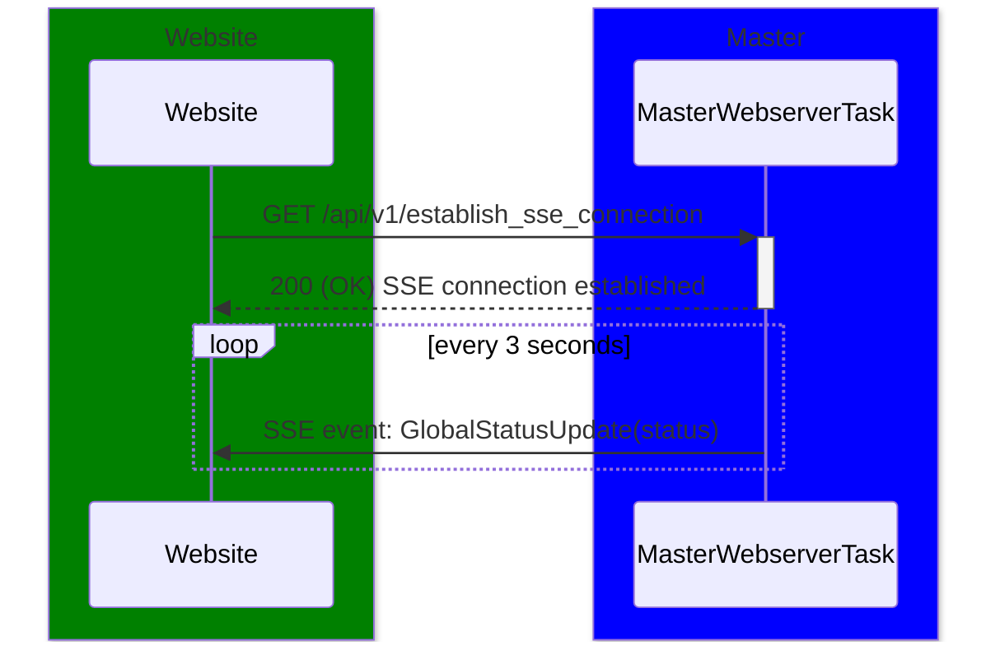
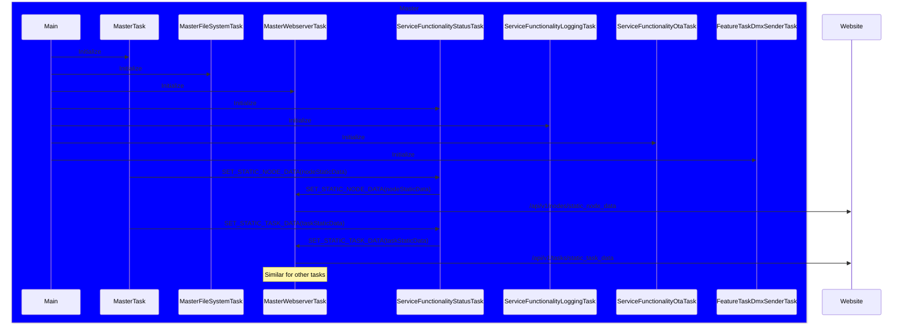
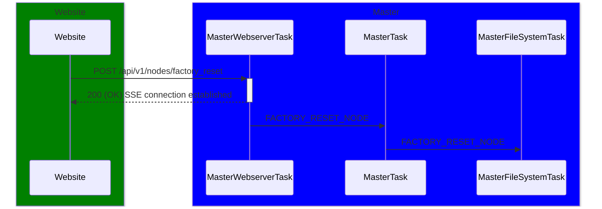

# SERVICE FUNCTIONALITY: NODES

# OVERVIEW

On the webpage, a special page with Nodes/tasks information is shown.

Some parts are static, some some dynamic.

Hearbeat information will be sent every 3 seconds from each node/task to the websever. Next to the heartbeat, other dynamic information is sent.

# SCENARIO 1: GLOBAL STATUS INDICATOR

## Overview

On each page of the website, a dot is shown to indicate the global status of the system. The dot is green if all tasks are running, yellow if heart beats are missed and red if there is no Wi-Fi connection.

An SSE (Server-Sent Events) connection is established between the webserver and the website to receive real-time updates on the global status of the system.
This SSE connection also will be used for other real-time updates, such as the dynamic data of the nodes and tasks, which is described in scenario 3.

## Requirements

- FR-NOD-101: The system shall display a global status indicator on each page of the website.
- FR-NOD-102: The global status indicator shall be green if all tasks are running and sending heartbeats as expected.
- FR-NOD-103: The global status indicator shall be yellow if heartbeats are missed.
- FR-NOD-104: The global status indicator shall be red if there is no Wi-Fi connection.
- FR-NOD-105: The system shall update the global status indicator in real-time based on the received heartbeats and Wi-Fi connection status.

## Design Decisions

## Website

On each page of the website, a dot is shown to indicate the global status of the system.

DD-NOD-001: An SSE (Server-Sent Events) connection shall be established between the webserver and the website to receive real-time updates on the global status of the system.

## Sequence Diagram



## Class Diagram

-

## API Contract

For establishing the SSE connection, the following API endpoint is used:

```
GET /api/v1/establish_sse_connection
```

**Response**:

```
event: GlobalStatusUpdate
data: {"status": true|false}
```

Where:

- `event`: The SSE event name, always `GlobalStatusUpdate` for this event.
- `data`: The payload, a JSON object with a single field:
  - `status`: boolean
    - `true`: All tasks are running and sending heartbeats as expected (system healthy).
    - `false`: One or more tasks missed heartbeats, or there is no Wi-Fi connection (system not healthy).

## ESP-NOW Messages

-

## RTOS Messages

-

# SCENARIO 2: STATIC DATA

## Overview

The static data is sent from each node/task as soon as all of its static node/task data is available.

In the following two tables, the static data is shown for each node and task:

Node:

| Item                       | Type               | Source                                      | Description                                                             |
| -------------------------- | ------------------ | ------------------------------------------- | ----------------------------------------------------------------------- |
| ID                         | uint16_t           | Master Task                                 | Unique identifier for the node.                                         |
| Name                       | std::string        | Master Task                                 | Human-readable name for the node.                                       |
| Chip Model                 | enum               | esp_chip_info(), model                      | The model of the chip used in the node.                                 |
| Chip Revision Number       | uint8_t            | esp_chip_info(), revision                   | The revision number of the chip.                                        |
| Number of Cores            | uint8_t            | esp_chip_info(), cores                      | The number of CPU cores in the node.                                    |
| CPU Frequency              | uint32_t           | esp_clk_cpu_freq()                          | The operating frequency of the CPU in MHz.                              |
| Flash Size in Megabytes    | uint32_t           | esp_flash_get_size()                        | The size of the flash memory in megabytes.                              |
| Firmware Version           | std::string        | Master Task                                 | The version of the firmware running on the node.                        |
| Configuration Version      | std::string        | FileSystemTask                              | The version of the configuration used by the node.                      |
| IDF Version                | std::string        | esp_get_idf_version()                       | The version of the ESP-IDF framework used in the firmware.              |
| OTA Partition Number       | esp_partition_t    | esp_ota_get_running_partition()             | The partition number used for over-the-air updates.                     |
| Last Reset Reason          | esp_reset_reason_t | esp_reset_reason()                          | The reason for the last reset of the node.                              |
| Uptime                     | int64_t            | esp_timer_get_time()                        | The amount of time the node has been running since the last reset.      |
| MAC Address                | uint8_t[6]         | esp_wifi_get_mac()                          | The MAC address of the node's Wi-Fi interface.                          |
| Wi-Fi SSID                 | char[33]           | esp_wifi_get_config()                       | The SSID of the Wi-Fi network the node is connected to.                 |
| Wi-Fi Primary Channel      | wifi_ap_record_t   | esp_wifi_sta_get_ap_info(), primary         | The primary channel of the Wi-Fi network the node is connected to.      |
| Wi-Fi RSSI Signal Strength | int8_t             | esp_wifi_sta_get_ap_info(), rssi            | The RSSI signal strength of the Wi-Fi network the node is connected to. |
| Wi-Fi Auth Mode            | wifi_auth_mode_t   | esp_wifi_sta_get_ap_info(), authmode        | The authentication mode of the Wi-Fi network the node is connected to.  |
| Wi-Fi Pairwise Cipher      | wifi_cipher_type_t | esp_wifi_sta_get_ap_info(), pairwise_cipher | The pairwise cipher used by the Wi-Fi network the node is connected to. |
| Wi-Fi Group Cipher         | wifi_cipher_type_t | esp_wifi_sta_get_ap_info(), group_cipher    | The group cipher used by the Wi-Fi network the node is connected to.    |
| Wi-Fi Secondary Channel    | wifi_ap_record_t   | esp_wifi_sta_get_ap_info(), secondary       | The secondary channel of the Wi-Fi network the node is connected to.    |

## Requirements

FR-NOD-206: The system shall send the static data of each node to the webserver after all nodes have been registered.
FR-NOD-207: The system shall send the static data of each task to the webserver after all nodes have been registered.

## Design Decisions

## Website

The static data is shown on the status page, for each node and for each task of each node.

## Sequence Diagram



## Class Diagram

-

## API Contract

### GET /api/v1/nodes/static_node_data

Retrieves the static data of all nodes.

```
GET /api/v1/nodes/static_node_data
```

**Response**:

```json
{
    "nodes_data": [                              // array of nodes
        {
            "node_id": uint16,                   // unique identifier for the node
            "node_name": string,                 // human-readable name for the node
            "node_static_data": {
                "chip_model": string,           // chip model name
                "number_of_cores": uint8,       // number of CPU cores
                "cpu_frequency": uint32,        // CPU frequency in MHz
                "chip_revision_number": uint8,  // chip hardware revision number
                "flash_size_in_megabytes": uint32, // flash memory size in MB
                "firmware_version": string,      // firmware version
                "configuration_version": string, // configuration version
                "idf_version": string,          // ESP-IDF framework version
                "ota_partition_number": uint8,  // active OTA partition number
                "last_reset_reason": string,    // last reset reason (see enum below)
                "uptime": int64,                // uptime in seconds since last reset
                "mac_address": string,           // MAC address, formatted as "XX:XX:XX:XX:XX:XX"
                "wifi_data": {
                    "wifi_ssid": string | null,     // Wi-Fi SSID (Master only; null for Slave)
                    "wifi_primary_channel": uint8 | null, // Wi-Fi primary channel (Master only; null for Slave)
                    "wifi_rssi_signal_strength": int8 | null, // Wi-Fi RSSI in dBm (Master only; null for Slave)
                    "wifi_auth_mode": string | null,      // Wi-Fi auth mode (Master only; null for Slave)
                    "wifi_pairwise_cipher": string | null,// Wi-Fi pairwise cipher (Master only; null for Slave)
                    "wifi_group_cipher": string | null    // Wi-Fi group cipher (Master only; null for Slave)
                }
            }
        }
    ]
}
```

`last_reset_reason` possible values:

| Value              | Description                           |
| ------------------ | ------------------------------------- |
| `UNKNOWN`          | Reset reason is unknown               |
| `POWER_ON_RESET`   | Power on reset                        |
| `EXTERNAL_RESET`   | External pin reset                    |
| `SOFTWARE_RESET`   | Software reset via `esp_restart()`    |
| `PANIC_RESET`      | Software reset due to exception/panic |
| `INT_WDT_RESET`    | Reset due to interrupt watchdog       |
| `TASK_WDT_RESET`   | Reset due to task watchdog            |
| `WDT_RESET`        | Reset due to other watchdogs          |
| `DEEP_SLEEP_RESET` | Reset after exiting deep sleep        |
| `BROWNOUT_RESET`   | Brownout reset due to low voltage     |
| `SDIO_RESET`       | Reset via SDIO                        |

**Example Request**:

```GET /api/v1/nodes/static_node_data

```

Response:

```
{
    "nodes_data": [
        {
            "node_id": 1,
            "node_name": "Master",
            "node_static_data": {
                "chip_model": "ESP32",
                "number_of_cores": 2,
                "cpu_frequency": 240,
                "chip_revision_number": 1,
                "flash_size_in_megabytes": 4,
                "firmware_version": "1.0.0",
                "configuration_version": "1.0.0",
                "idf_version": "4.4.3",
                "ota_partition_number": 1,
                "last_reset_reason": "POWER_ON_RESET",
                "uptime": 3600,
                "mac_address": "DE:AD:BE:EF:00:01",
                "wifi_data": {
                    "wifi_ssid": "MyNetwork",
                    "wifi_primary_channel": 6,
                    "wifi_rssi_signal_strength": -70,
                    "wifi_auth_mode": "WPA2_PSK",
                    "wifi_pairwise_cipher": "CCMP",
                    "wifi_group_cipher": "CCMP"
                }
            },
            ...
        },
        ...
    ]
}
```

### GET /api/v1/tasks/static_task_data

Retrieves the static data of all tasks of all nodes.

```
GET /api/v1/tasks/static_task_data
```

**Response**:

```json
{
    "tasks_data": [                              // array of tasks
        {
            "node_id": uint16,                   // unique identifier for the node this task belongs to
            "task_id": uint8,                    // unique identifier for the task within the node
            "task_name": string,                 // human-readable name for the task
            "task_stack_size": uint32,            // stack size allocated for the task in bytes
            "task_priority": uint8,              // priority level of the task (0-255)
            "task_core_affinity": uint8           // core affinity mask (bitmask indicating which CPU cores the task can run on)
        }
    ]
}
```

**Example Request**:

```GET /api/v1/tasks/static_task_data

```

Response:

```json
{
    "tasks_data": [
        {
            "node_id": 1,
            "task_id": 1,
            "task_name": "MasterTask",
            "task_stack_size": 4096,
            "task_priority": 5,
            "task_core_affinity": 0b11 // can run on both cores
        },
        {
            "node_id": 1,
            "task_id": 2,
            "task_name": "MasterWebserverTask",
            "task_stack_size": 8192,
            "task_priority": 10,
            "task_core_affinity": 0b01 // can only run on core 0
        },
        ...
    ]
}
```

## ESP-NOW Messages

-

## RTOS Messages

| Message              | ID  | Source     | Destination   | Field    | Data Type | Frequency | Description      |
| -------------------- | --- | ---------- | ------------- | -------- | --------- | --------- | ---------------- |
| SET_STATIC_NODE_DATA | 100 | MasterTask | MasterWebTask | See list | See list  | Once      | Static node data |
| SET_STATIC_TASK_DATA | 101 | MasterTask | MasterWebTask | See list | See list  | Once      | Static task data |

Acks are not needed.

# SCENARIO 3: DYNAMIC DATA

## Overview

Every three seconds the webserver sends an SSE event to the website for every node and every task.

## Requirements

FR-NOD-301: The system shall send the dynamic data of each node to the webserver every 3 seconds.

## Design Decisions

## Website

The dynamic data is shown on the status page, for each node and for each task of each node.

## Sequence Diagram

n.a.

## Class Diagram

n.a.

## API Contract

````mermaid

For a node, this is sent:

event: dynamic_node_data
```json
data: {
    "node_status": "OK" | "MISSED_HEARTBEAT" | "NO_WIFI_CONNECTION",
    "wifi_rssi_signal_strength": integer,
    "number_of_tasks": integer,
    "task_free_heap_size": integer,
    "task_minimum_ever_free_heap_size": integer,
    "cpu_temperature": integer,
}
````

For a task, this is sent:

event: dynamic_task_data

```json
data: {
    "task_id": integer,
    "task_status": "OK" | "MISSED_HEARTBEAT",
    "task_state": "RUNNING" | "READY" | "BLOCKED" | "SUSPENDED" | "DELETED",
    "task_stack_high_water_mark": integer
}
```

**Example Request**:

event: dynamic_node_data,

```json
data: {
    "node_status": "OK",
    "wifi_rssi_signal_strength": -70,
    "number_of_tasks": 5,
    "task_free_heap_size": 2048,
    "task_minimum_ever_free_heap_size": 1024,
    "cpu_temperature": 60
}

```

event: dynamic_task_data,

```json
data: {
    "task_id": 1,
    "task_status": "OK",
    "task_state": "RUNNING",
    "task_stack_high_water_mark": 512
}
```

## ESP-NOW Messages

n.a.

## RTOS Messages

| Message               | ID  | Source          | Destination   | Field    | Data Type | Frequency | Description       |
| --------------------- | --- | --------------- | ------------- | -------- | --------- | --------- | ----------------- |
| SET_DYNAMIC_NODE_DATA | 100 | MasterTask      | MasterWebTask | See list | See list  | Once      | Dynamic node data |
| SET_DYNAMIC_TASK_DATA | 101 | Any Master Task | MasterWebTask | See list | See list  | Once      | Dynamic task data |

Acks are not needed.

# SCENARIO 4: OTA Update

This is handled in a separate document: [OTA Update Service Functionality](service_functionality_ota.md).

# SCENARIO 5: Reboot

## Overview

This reboots the system (master and all slaves) when the user clicks the reboot button on the website.

## Requirements

FR-NOD-500: The user shall be able to reboot the system (master and all slaves) by clicking a reboot button on the website.
FR-NOD-501: The user shall be able to reboot a single node (either Master or Slave) by clicking a reboot button on the website.

## Design Decisions

FR-NOD-500: An Are you sure message shall be shown to the user before performing the reboot, to prevent accidental reboots.

## Website

In the Nodes webpage, a button Reboot is shown for each node and a button Reboot System' is shown for the whole system.

## Sequence Diagram

-

## Class Diagram

-

## API Contract

### POST /api/v1/nodes/reboot

Triggers a reboot of a single node.

```
POST /api/v1/nodes/reboot
```

**Request**:

```json
{
  "nodeId": 2
}
```

Where:

- `nodeId`: Unique identifier of the node to reboot.

**Responses**:

- `202 Accepted`: Reboot command accepted and scheduled.
- `400 Bad Request`: Missing or invalid `nodeId`.
- `404 Not Found`: Node with `nodeId` does not exist.

**Example Response (202 Accepted)**:

```json
{
  "status": "queued",
  "action": "reboot_node",
  "nodeId": 2,
  "message": "Reboot command accepted"
}
```

### POST /api/v1/system/reboot

Triggers a system reboot (Master and all registered Slave nodes).

```
POST /api/v1/system/reboot
```

**Request**:

```json
{}
```

**Responses**:

- `202 Accepted`: System reboot command accepted and scheduled.

**Example Response (202 Accepted)**:

```json
{
  "status": "queued",
  "action": "reboot_system",
  "message": "System reboot command accepted"
}
```

## ESP-NOW Messages

No messages needed (later for Slaves only).

## RTOS Messages

No messages needed (later for Slaves only).

# SCENARIO 6: Factory Reset

## Overview

This resets the system to factory settings (master and all slaves) when the user clicks the factory reset button on the website.

## Requirements

FR-NOD-600: The user shall be able to reset the system to factory settings (master and all slaves) by clicking a factory reset button on the website.
FR-NOD-601: The user shall be able to reset a single node (either Master or Slave) to factory settings by clicking a factory reset button on the website.

## Design Decisions

DD-NOD-600: An are you sure message shall be shown to the user before performing the factory reset, to prevent accidental resets.

## Website

A Factory Reset button is shown on the Nodes webpage for each node and for the whole system.

## Sequence Diagram



## Class Diagram

-

## API Contract

### POST /api/v1/nodes/factory_reset

Triggers a factory reset of a single node.

```
POST /api/v1/nodes/factory_reset
```

**Request**:

```json
{
  "nodeId": 2
}
```

Where:

- `nodeId`: Unique identifier of the node to factory reset.

**Responses**:

- `202 Accepted`: Factory reset command accepted and scheduled.
- `400 Bad Request`: Missing or invalid `nodeId`.
- `404 Not Found`: Node with `nodeId` does not exist.

**Example Response (202 Accepted)**:

```json
{
  "status": "queued",
  "action": "factory_reset_node",
  "nodeId": 2,
  "message": "Factory reset command accepted"
}
```

### POST /api/v1/system/factory_reset

Triggers a factory reset of the entire system (Master and all registered Slave nodes).

```
POST /api/v1/system/factory_reset
```

**Request**:

```json
{}
```

**Responses**:

- `202 Accepted`: System factory reset command accepted and scheduled.

**Example Response (202 Accepted)**:

```json
{
  "status": "queued",
  "action": "factory_reset_system",
  "message": "System factory reset command accepted"
}
```

## ESP-NOW Messages

Not needed (later for Slaves only).

## RTOS Messages

| Message              | ID  | Source     | Destination          | Field | Data Type | Frequency | Description                                |
| -------------------- | --- | ---------- | -------------------- | ----- | --------- | --------- | ------------------------------------------ |
| FACTORY_RESET_NODE   | 100 | MasterTask | MasterFileSystemTask | none  | none      | Once      | Command to factory reset a single node     |
| FACTORY_RESET_SYSTEM | 101 | MasterTask | MasterFileSystemTask | none  | none      | Once      | Command to factory reset the entire system |

## Future Improvements

FACTORY_RESET_NODE can have an ID for a slave node.
