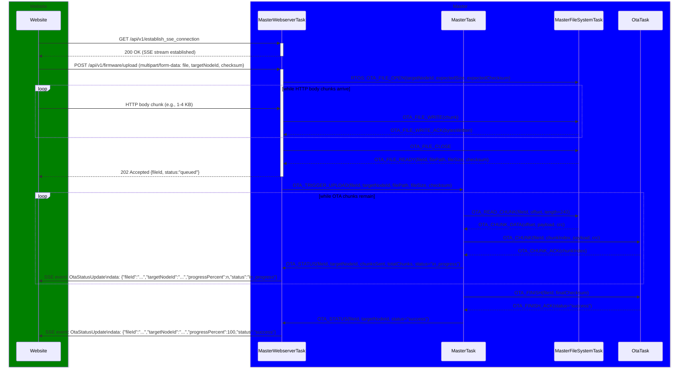

# SERVICE FUNCTIONALITY: OTA

# OVERVIEW

On the webpage, part of the status page, OTA support is available.

# SCENARIO 1: OTA UPDATE

## Overview

The user can upload a new firmware binary file and trigger an OTA update. The system will then perform the OTA update and provide feedback on the status of the update process, followed by a restart.

## Requirements

- FR-OTA-001: The system shall allow the user to upload a new firmware binary file.
- FR-OTA-002: The system shall perform an OTA update using the uploaded firmware binary file.
- FR-OTA-003: The system shall provide feedback on the status of the OTA update process.
- FR-OTA-004: The system shall restart after a successful OTA update.
- FR-OTA-005: The system shall update the global status indicator in real-time based on the received heartbeats and Wi-Fi connection status.

## Design Decisions

DD-OTA-001: A safe OTA update mechanism will be implemented, which includes retries and checksums.

## Website

- Button <Upload Firmware>.

## Sequence Diagram



## Class Diagram

n.a.

## API Contract

For OTA upload and OTA status updates, the following API endpoints are used:

```
POST /api/v1/firmware/upload
GET /api/v1/establish_sse_connection
```

### POST /api/v1/firmware/upload

Uploads a firmware binary for a target node.

The request uses `multipart/form-data` and contains:

- `file`: The firmware binary file.
- `targetNodeId`: The target node that shall receive the firmware.
- `checksum`: The expected checksum of the complete firmware file.

**Example Request**:

```http
POST /api/v1/firmware/upload
Content-Type: multipart/form-data

file=<firmware.bin>
targetNodeId=2
checksum=3f2a9c1e...
```

**Response**:

```json
{
    "fileId": string,
    "status": "queued"
}
```

Where:

- `fileId`: Unique identifier for the uploaded firmware file.
- `status`: Upload result after the file has been accepted and stored by the system.

**Example Response**:

```json
{
  "fileId": "ota-fw-20260414-001",
  "status": "queued"
}
```

### GET /api/v1/establish_sse_connection

Establishes the SSE connection used to send OTA progress updates to the website.

```
GET /api/v1/establish_sse_connection
```

**Response**:

During OTA processing, the webserver sends SSE events for OTA status updates:

```
event: OtaStatusUpdate
data: {"fileId":"string","targetNodeId":integer,"progressPercent":integer,"status":"queued|in_progress|success|failure","message":"string|null"}
```

Where:

- `event`: The SSE event name, always `OtaStatusUpdate` for OTA progress.
- `data`: The payload, a JSON object with the following fields:
  - `fileId`: Unique identifier of the uploaded firmware file.
  - `targetNodeId`: Identifier of the node being updated.
  - `progressPercent`: Integer from 0 to 100.
  - `status`: Current OTA state.
    - `queued`: The upload was accepted and is waiting for dispatch.
    - `in_progress`: Chunks are currently being dispatched to the target node.
    - `success`: The OTA finished successfully.
    - `failure`: The OTA failed.
  - `message`: Optional human-readable status or error message.

**Example Response**:

```
event: OtaStatusUpdate
data: {"fileId":"ota-fw-20260414-001","targetNodeId":2,"progressPercent":45,"status":"in_progress","message":null}
```

## ESP-NOW Messages

| Message | Source | Destination | Fields | Description |
| ------- | ------ | ----------- | ------ | ----------- |

## RTOS Messages

| Message              | Source                 | Destination            | Fields                                                                     | Description                                                            |
| -------------------- | ---------------------- | ---------------------- | -------------------------------------------------------------------------- | ---------------------------------------------------------------------- |
| `OTA_CHUNK`          | `MasterTask`           | `OtaTask`              | `fileId`, `chunkIndex`, `payload`, `crc`                                   | Sends one OTA firmware chunk to the target node.                       |
| `OTA_CHUNK_ACK`      | `OtaTask`              | `MasterTask`           | `chunkIndex`                                                               | Acknowledges successful reception of one OTA chunk.                    |
| `OTA_CHUNK_DATA`     | `MasterFileSystemTask` | `MasterTask`           | `offset`, `payload`, `crc`                                                 | Returns one firmware chunk read from storage.                          |
| `OTA_FILE_OPEN`      | `MasterWebserverTask`  | `MasterFileSystemTask` | `targetNodeId`, `expectedSize`, `expectedChecksum`                         | Opens a new file for the OTA upload.                                   |
| `OTA_FILE_WRITE`     | `MasterWebserverTask`  | `MasterFileSystemTask` | `chunk`                                                                    | Writes one received HTTP body chunk to the OTA file.                   |
| `OTA_FILE_WRITE_ACK` | `MasterFileSystemTask` | `MasterWebserverTask`  | `bytesWritten`                                                             | Acknowledges that the previous chunk was written successfully.         |
| `OTA_FILE_CLOSE`     | `MasterWebserverTask`  | `MasterFileSystemTask` | none                                                                       | Closes the OTA file after the complete upload was received.            |
| `OTA_FILE_READY`     | `MasterFileSystemTask` | `MasterWebserverTask`  | `fileId`, `filePath`, `fileSize`, `checksum`                               | Indicates that the uploaded file is stored and validated.              |
| `OTA_FINISH`         | `MasterTask`           | `OtaTask`              | `fileId`, `finalChecksum`                                                  | Signals that all chunks were sent and requests final validation/apply. |
| `OTA_FINISH_ACK`     | `OtaTask`              | `MasterTask`           | `status`, `message`                                                        | Returns final OTA result from target node.                             |
| `OTA_READ_CHUNK`     | `MasterTask`           | `MasterFileSystemTask` | `fileId`, `offset`, `length`                                               | Requests the next firmware chunk from the stored file.                 |
| `OTA_STATUS`         | `MasterTask`           | `MasterWebserverTask`  | `fileId`, `targetNodeId`, `chunksSent`, `totalChunks`, `status`, `message` | Reports OTA progress or final result to the webserver.                 |
| `OTA_TRIGGER_UPLOAD` | `MasterWebserverTask`  | `MasterTask`           | `fileId`, `targetNodeId`, `filePath`, `fileSize`, `checksum`               | Starts OTA dispatch for the target node.                               |
