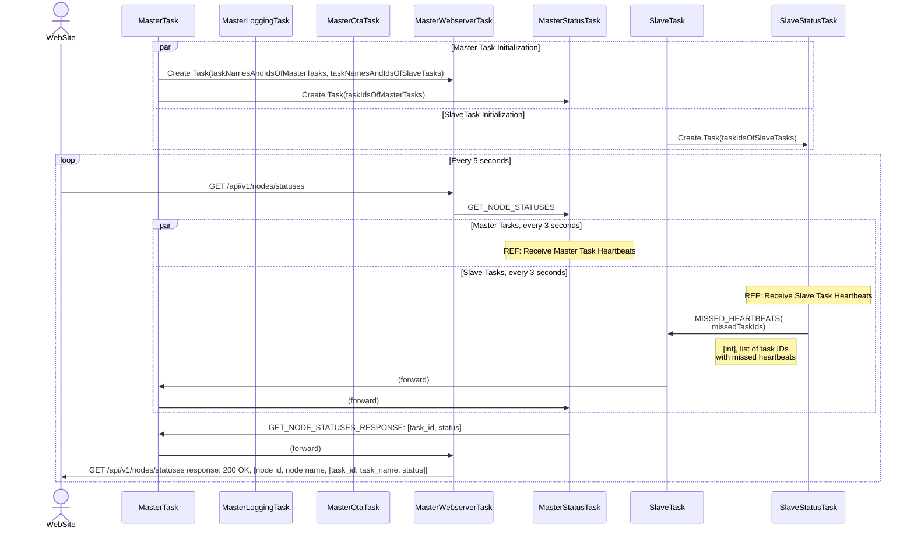
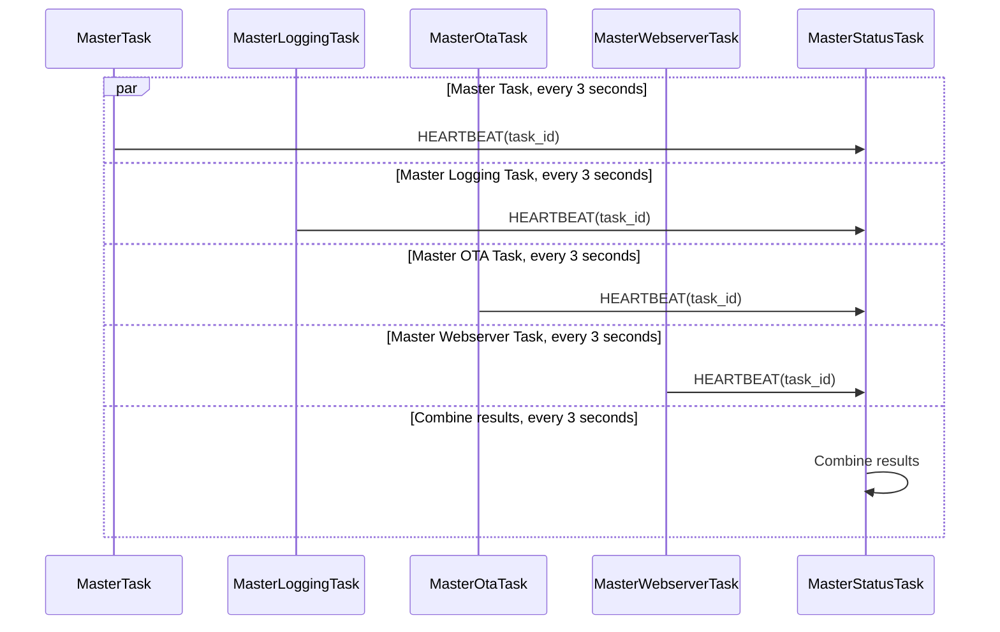
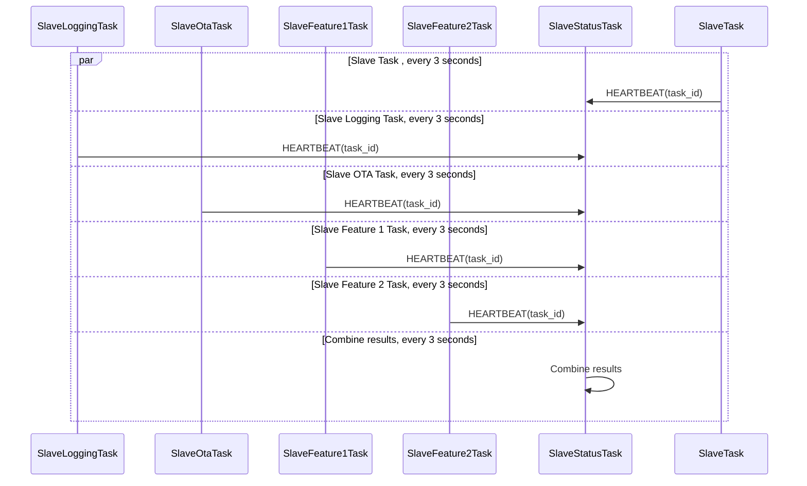

# RTOS MESSAGES BETWEEN SERVICE TASKS

# Introduction

This document outlines the messages exchanged between various service tasks in the RTOS environment. Each message is defined with its source task, destination task, and the data it carries. This communication is crucial for maintaining the functionality and coordination of tasks such as monitoring, logging, and over-the-air updates.

It is irrelevant for the messages if the message is sent directly between tasks, via the Master Task (which is default) or via ESP-NOW in case the task is residing on a slave node. The Master Task will forward the message to the destination task regardless of the source.

# Status Functionality 

The Master Task creates a Webserver Task that receives a list of task names and IDs per node from the Master Task. The task names will be used to complete the GET_NODE_STATUSES_RESPONSE message with task names before sending it back to the web client.
The Master Task also creates a Status Task that receives a list of task IDs from the Master Task.

Every 5 seconds, the web server task will send a GET_NODE_STATUSES message to the status task to request the current status of all tasks. 

The status task will receive heartbeats from all tasks approximately every 3 seconds. If a heartbeat is missed for a task, the status task will send a MISSED_HEARTBEATS message to the master status task with the list of missed task IDs. An empty list indicates that all heartbeats were received successfully. 

The web server task will not wait for the status task to respond to the GET_NODE_STATUSES message before responding to the web client. This means that the web server task will respond with the most recent statuses it has received from the status task, which may be up to 5 seconds old. 

The webserver task will respond with a GET_NODE_STATUSES_RESPONSE message containing the current status of all tasks, for all nodes. The status of a task can be 'OK' or 'MISSED_HEARTBEAT'. The web server task will include the task names in the response by matching the task IDs with the task names it received from the master task during initialization.

| Message           | Source      | Destination     | Field     | Data Type | Description                                                                                                                                                             |
| ----------------- | ----------- | --------------- | --------- | --------- | ----------------------------------------------------------------------------------------------------------------------------------------------------------------------- |
| GET_NODE_STATUSES | Web Server Task | Status Task     | -         | -         | Sent by the web server task to request the current status of all tasks. The status task will respond with a GET_NODE_STATUSES_RESPONSE message containing the statuses of all tasks. |
| GET_NODE_STATUSES_RESPONSE | Status Task | Web Server Task | task_statuses | list
| HEARTBEAT | Any Task    | Status Task     | task_id   | int       | Sent by a task to indicate that the task is still alive. This message should be sent approximately every 3 seconds.                                                     |
| MISSED_HEARTBEATS | Slave Status Task | Master Status Task        | missed_task_ids | list | Task IDs for which heartbeats were missed.  An empty list indicates that all heartbeats were received successfully.

# Logging 

Logging happens in contrary to the status task both on the website (Master) and via UART output on both the Master and slave nodes. The logging task receives log messages from all tasks and forwards them to the web server task to be displayed on the website. The logging task also forwards the log messages to the its master or slave logging task, which will forward them to the slave nodes to be displayed via UART output.

A logging message contains of a task ID, log category, log level and the message to be logged. The log category can be INFO, WARNING or ERROR. The log level is a uint8 value that can be set for each log category to filter out messages below a certain log level.

| Message       | Source          | Destination  | Field     | Data Type | Description                                   |
| ------------- | --------------- | ------------ | --------- | --------- | --------------------------------------------- |
| SET_LOG_LEVEL | Web Server Task | Logging Task | Task ID  | uint16   | ID of the task for which the log level is being set. |
| | | | category  | uint8     | Log category (e.g., INFO, WARNING, ERROR).    |
|               |                 |              | log_level | uint8     | Set the log level for the specified category. |
| LOG_MESSAGE   | Any Task        | Logging Task | Task ID | uint16   | ID of the task that is sending the log message. |
| | | | category  | uint8     | Log category (e.g., INFO, WARNING, ERROR).    |
|               |                 |              | log_level | uint8     | Log level for the specified category.         |
|               |                 |              | message   | string    | String to be logged.                          |

# OTA Task

| Message               | Source          | Destination     | Field              | Data Type   | Description                                                                                                                                                                                                                     |
| --------------------- | --------------- | --------------- | ------------------ | ----------- | ------------------------------------------------------------------------------------------------------------------------------------------------------------------------------------------------------------------------------- |
| OTA_UPDATE_REQUEST    | Web Server Task | OTA Task        | node_id            | uint8       | Node ID of the device to receive the OTA update. TODO: node_id or MAC address?                                                                                                                                                  |
|                       |                 |                 | version            | string      | Version of the OTA update.                                                                                                                                                                                                      |
|                       |                 |                 | number_of_packages | uint16      | Number of packages that the web server task will sent (4 bytes).                                                                                                                                                                |
| OTA_UPDATE_REQUEST_OK | OTA Task        | Web Server Task | -                  | -           | If not received, the web server task will show an error that OTA will not start due to an unresponsive OTA task.                                                                                                                |
| OTA_PACKAGE           | Web Server Task | OTA Task        | package_number     | uint16      | Package number. The next message is only sent after a OTA_PACKAGE_RESULT                                                                                                                                                        |
|                       |                 |                 | data               | uint8[1024] | OTA package data, 1 KB of data per package.                                                                                                                                                                                     |
|                       |                 |                 | checksum           | uint32      | Checksum of the package data.                                                                                                                                                                                                   |
| OTA_PACKAGE_RESULT    | OTA Task        | Web Server Task | package_number     | uint16      | Package number. The next package will only be sent after receiving this message.                                                                                                                                                |
|                       |                 |                 | success            | bool        | Indicates whether the package was received successfully. A resent will be done if success is false, if the package number is not equal to the expected package number, or if the result has not been received within 3 seconds. |
| OTA_UPDATE_COMPLETE   | OTA Task        | Web Server Task | -                  | -           | Indicates that the OTA update process is complete. A restart will follow. If not received within 3 seconds after the last OTA_PACKAGE_RESULT, a message on the web server will be shown.                                        |
--------_________________------------------------------------------------------