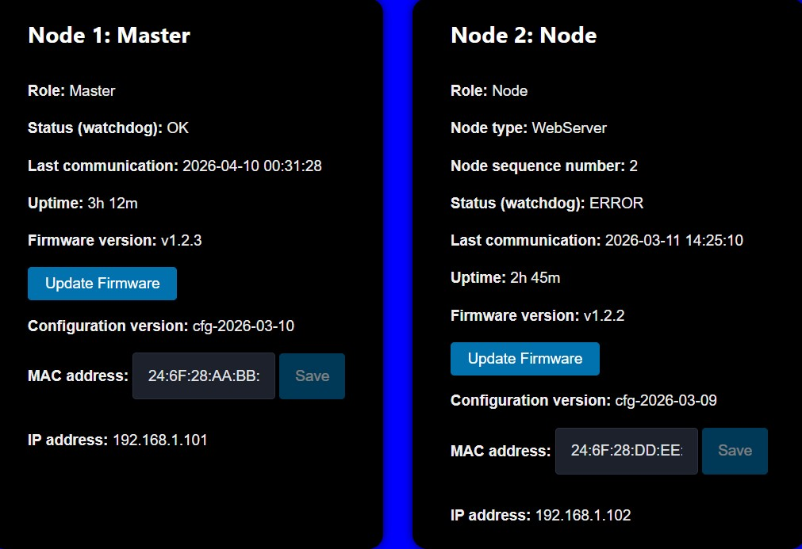
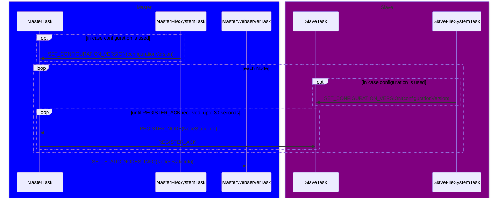
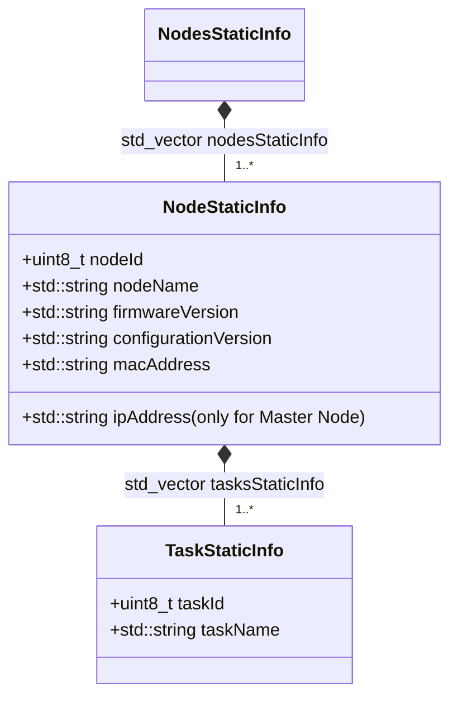
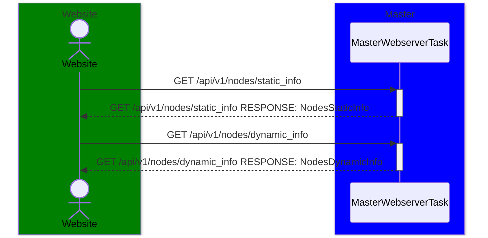
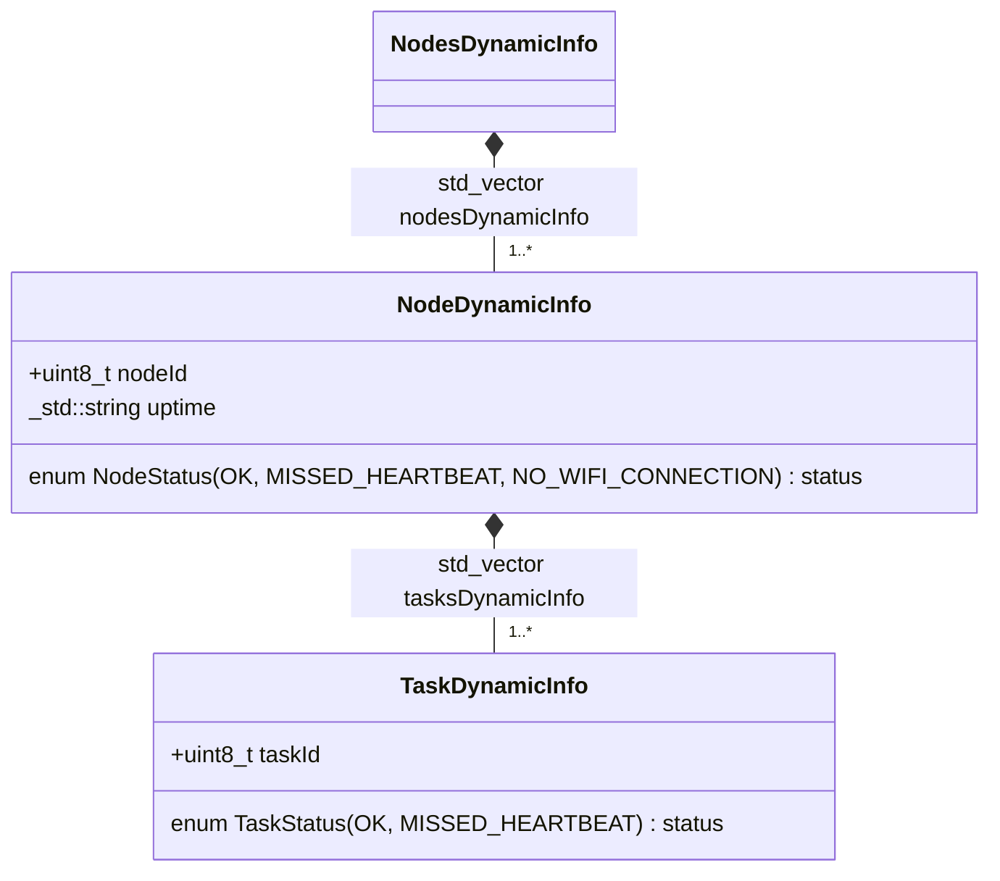
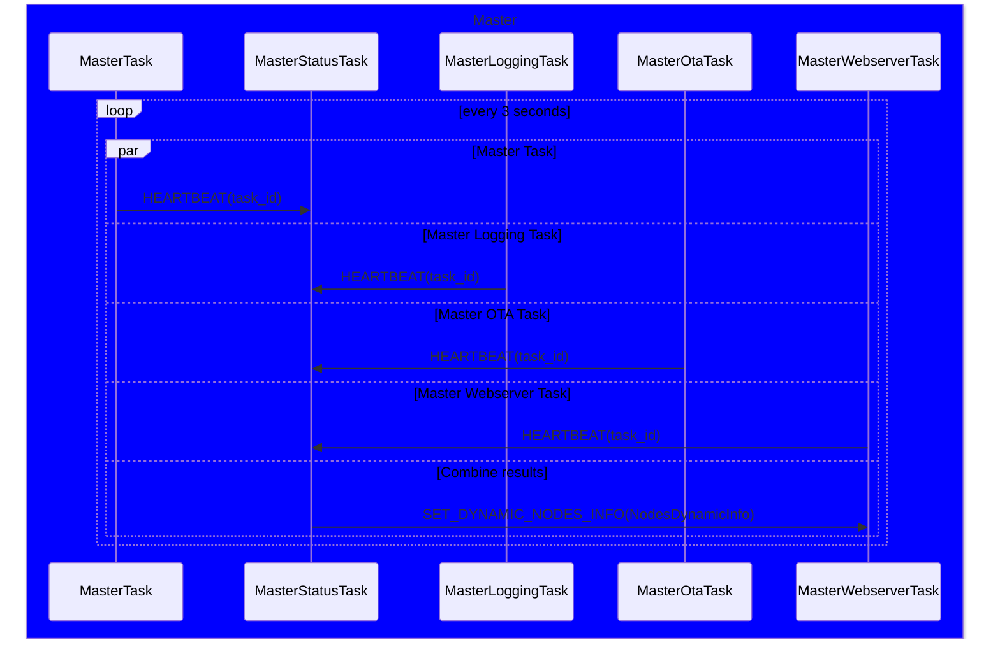
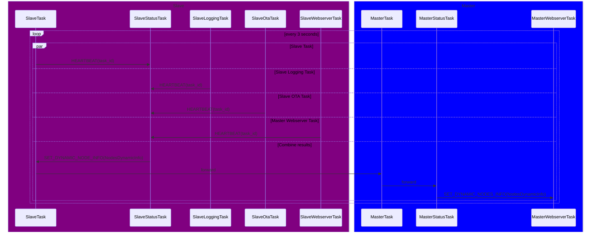

# SERVICE FUNCTIONALITY: STATUS

# Website and API

Each page on the website should display a dot to show the health status of the system. The dot should be green if all tasks are running, yellow if heart beats are missed and red if there is no Wi-Fi connection. The website should also have an API endpoint to get the status of all tasks. The API endpoint should return a list of task statuses, which includes the task name, task ID, node ID and status.

The following info per node is shown in the Nodes page:

- Node Name: Name of the node
- Node ID: ID of the node, 0-255
- Status: OK, Missed Heartbeat
- Last Communication: Time since the last message was received from the node
- Uptime: Time since the node was last restarted
- Firmware version: Version of the firmware running on the node
- Button to update firmware (this is OTA functionality)
- Configuration version: Version of the configuration running on the node
- MAC Address: MAC address of the node (can be edited)
- IP Address: IP address of the node (only for the master node)
- Tasks: List of tasks with ID, name and status (OK, Missed Heartbeat)



# Scenario: Initialization

The Master task sends the static information of all nodes to the webserver task during initialization after all nodes have been registered. The Master task knows how many nodes exists in the project and tries for 30 seconds to register each node.

It will add also nonregistered nodes in the SET_STATIC_NODES_INFO message.

## Sequence Diagram



## Class Diagram



The following information is stored in NVS:

```
[configuration]
nodeId=1
nodeName=Master
nodeSequenceNumber=1
configurationVersion=1.0.0
wifi_ssid=MyNetwork
wifi_password=SuperSecret123
```

The following items are retrieved different:

- firmwareVersion=1.0.0: hardcoded
- macAddress: retrieved from the Wi-Fi module using esp_wifi_get_mac()
- ipAddress: retrieved from the network stack after connecting to Wi-Fi

# Scenario: Nodes page on the website

The webserver API already contains all data which is sent during initialization.
Only status data (hearbeats) are updated every 3 seconds on average.

## Sequence Diagram



## Class Diagram



# Scenario: Status Task Heartbeats

## Master Task heartbeat



## Slave Task heartbeat



# API Contract

GET /api/v1/nodes/static_info
GET /api/v1/nodes/static_info RESPONSE: NodesStaticInfo

GET /api/v1/nodes/dynamic_info
GET /api/v1/nodes/dynamic_info RESPONSE: NodesDynamicInfo

# ESP-NOW Messages

| Message                | ID  | Source          | Destination      | Field     | Data Type        | Frequency                 | Description                                                                                       |
| ---------------------- | --- | --------------- | ---------------- | --------- | ---------------- | ------------------------- | ------------------------------------------------------------------------------------------------- |
| REGISTER_NODE          | 0   | SlaveTask       | MasterTask       | nodeInfo  | NodeStaticInfo   | Once per node             | Sent by a slave task to register itself with the master task.                                     |
| REGISTER_ACK           | 1   | MasterTask      | SlaveTask        |           |                  | Once per node             | Acknowledgment sent                                                                               |
| SET_DYNAMIC_NODES_DATA | 2   | SlaveStatusTask | MasterStatusTask | nodesData | NodesDynamicInfo | Every 5 seconds, per node | Sent by the master status task to update the webserver with the latest dynamic nodes information. |

# RTOS Messages

| Message                   | ID  | Source              | Destination         | Field         | Data Type        | Frequency                 | Description                                                                                       |
| ------------------------- | --- | ------------------- | ------------------- | ------------- | ---------------- | ------------------------- | ------------------------------------------------------------------------------------------------- |
| REGISTER_NODE             | 0   | SlaveTask           | MasterTask          | nodeInfo      | NodeStaticInfo   | Once per node             | Sent by a slave task to register itself with the master task.                                     |
| REGISTER_ACK              | 1   | MasterTask          | SlaveTask           |               |                  | Once per node             | Acknowledgment sent by the master task to confirm the registration of a slave task.               |
| SET_CONFIGURATION_VERSION | 2   | SlaveFileSystemTask | SlaveTask           | configVersion | uint32_t         | Once per node             | Sent by the file system task to update the configuration version in the slave task.               |
| SET_STATIC_NODES_INFO     | 3   | MasterTask          | MasterWebserverTask | nodesInfo     | NodesStaticInfo  | Once                      | Sent by the master task to update the webserver with the latest nodes information.                |
| HEARTBEAT                 | 4   | Any Task            | Status Task         | tsk_id        | uint8_t          | Every 3 seconds, per task | Sent by a task to indicate that the task is still alive.                                          |
| SET_DYNAMIC_NODES_DATA    | 5   | MasterStatusTask    | MasterWebserverTask | nodesData     | NodesDynamicInfo | Every 5 seconds, per node | Sent by the master status task to update the webserver with the latest dynamic nodes information. |
